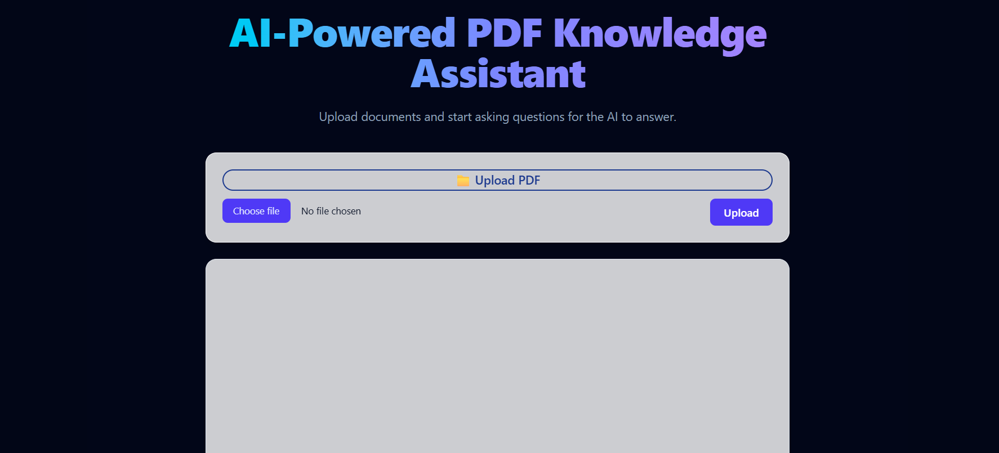

# AI-Powered PDF Knowledge Assistant 🤖📄

An AI-powered web application that allows users to upload PDF documents and interact with them using natural language. The app processes document content and enables users to ask questions, extract insights, and receive contextual answers powered by AI, all through an intuitive and responsive interface.

---

## Table of contents

- Overview
- The challenge
- Screenshot
- Links
- My process
- Built with
- Key Takeaways
- Technologies Used
- Useful resources
- Author

---

## Overview

This project focuses on combining modern frontend development with AI-powered backend logic to create an intelligent document assistant. Users can upload PDF files and query their content using conversational prompts, transforming static documents into interactive knowledge sources.

The application emphasizes usability, clarity, and real-world AI integration, showcasing how large language models can be applied to practical document-based workflows.

---

## The challenge

Users should be able to:

- Upload PDF documents securely
- Ask questions about the content of uploaded PDFs
- Receive accurate, contextual, and human-readable answers
- Interact with documents using natural language
- Experience smooth UI feedback during loading and processing states
- Understand how AI can be applied to real document analysis use cases

---

## Screenshot

📸 Screenshot of the application  

## Links

Solution URL: 

Live Site URL: 

## My process
### Built with
   - Semantic HTML5 markup
   - Modern CSS styling
   - React (with Hooks)
   - JavaScript (ES6+)
   - AI / LLM integration
   - PDF parsing and text extraction
   - RESTful API communication
   - Vercel for deployment
   - Git & GitHub for version control

## 🔑 Key Takeaways

This project significantly deepened my understanding of building AI-enhanced web applications and working with complex data flows.

1. AI Integration in Web Applications
Learned how to integrate AI models into a real-world application, enabling natural language interaction with structured and unstructured data.

2. PDF Parsing and Text Extraction
Implemented logic to extract and preprocess text from uploaded PDF documents, making the content usable for AI-driven analysis.

3. Handling Asynchronous Data Flows
Managed asynchronous operations such as file uploads, API calls, and AI responses while maintaining a responsive user experience.

4. Prompt Design and Context Handling
Worked with prompt construction to ensure that AI responses are relevant, accurate, and grounded in the document content.

5. State Management
Used React’s useState and useEffect hooks to manage document state, user input, loading indicators, and AI responses.

6. User Experience Design
Focused on clear UI feedback, including loading states, error handling, and readable answer formatting to improve usability.

7. Component-Based Architecture
Structured the application into reusable components, improving readability, maintainability, and scalability.

8. Deployment and Environment Configuration
Deployed the application using Vercel and handled environment variables securely for API keys and configuration.

## 🛠️ Technologies Used

   - React (with Hooks)
   - JavaScript (ES6+)
   - HTML5 / CSS3
   - LangChain & LangIndex
   - AI / Large Language Models
   - PDF Parsing Libraries
   - Node.js
   - Git & GitHub
   - Vercel

### Author

- Website: [Madalina Pastiu Portfolio](https://maddiepst.github.io/)
- LinkedIn: [Madalina Pastiu](www.linkedin.com/in/madalina-p-52a01396)
- GitHub: [@maddiepst](https://github.com/MaddiePst)

